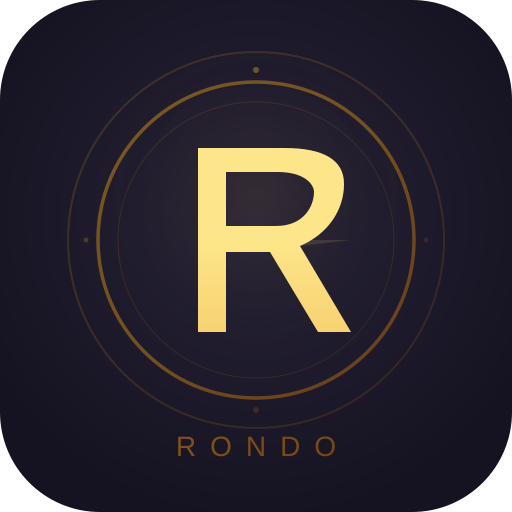

<div align="center">
  
  <h1>Rondo</h1>
  <p><strong>通用多经济系统 Minecraft 插件</strong></p>
  <p>配置驱动 · 高性能 · 可扩展</p>

  
  
  
  
</div>

---

## 简介

Rondo 是一个基于 [Blink](https://github.com/17Artist/Blink) 框架的通用多货币经济系统插件。通过 YAML 配置文件自由定义任意数量的货币类型，无需修改代码即可构建完整的服务器经济体系。

## 特性

- **无限货币类型** — YAML 配置驱动，支持小数精度、余额上限、转账税率等属性
- **内置兑换系统** — 货币间兑换规则，支持比率设定、周期限购（日/周/月）
- **排行榜系统** — 自动维护每种货币的排行榜，定时刷新
- **完整流水日志** — 异步记录每笔交易，支持按货币、时间查询，自动清理过期日志
- **Vault & PlaceholderAPI** — 无缝对接主流插件生态
- **高性能设计** — 内存缓存 + 异步批量持久化，支持 SQLite 和 MySQL
- **离线操作** — 管理员命令支持对离线玩家操作

## 环境要求

| 项目 | 要求 |
|------|------|
| Minecraft | 1.18.2+ |
| 服务端 | Spigot / Paper |
| Java | 17+ |
| 前置 | [Blink](https://github.com/17Artist/Blink) 1.1.0+ |

## 快速开始

1. 安装 [Blink](https://github.com/17Artist/Blink) 框架
2. 将 `Rondo-x.x.x.jar` 放入 `plugins/` 目录
3. 启动服务器，自动生成配置文件
4. 编辑 `plugins/Rondo/currencies/` 下的货币配置
5. `/rondo reload` 重载

## 命令

### 玩家命令

| 命令 | 说明 |
|------|------|
| `/money` | 查看所有货币余额 |
| `/money pay <玩家> <货币> <数量>` | 转账 |
| `/money exchange <源> <目标> <数量>` | 兑换 |
| `/money log [货币] [页码]` | 查看交易记录 |
| `/money top <货币> [页码]` | 排行榜 |

### 管理员命令

| 命令 | 说明 |
|------|------|
| `/rondo give <玩家> <货币> <数量>` | 发放货币 |
| `/rondo take <玩家> <货币> <数量>` | 扣除货币 |
| `/rondo set <玩家> <货币> <数量>` | 设置余额 |
| `/rondo check <玩家> [货币]` | 查看余额 |
| `/rondo log <玩家> [货币] [页码]` | 查看流水 |
| `/rondo reload` | 重载配置 |

## 货币配置示例

```yaml
# plugins/Rondo/currencies/gold.yml
id: gold
display-name: "金币"
symbol: "G"
color: "GOLD"
description: "游戏内通用货币"

decimal-places: 0
max-balance: -1
default-balance: 0
negative-allowed: false

tradeable: true
transferable: true
transfer-tax-rate: 0.05

vault-primary: true
ranking-enabled: true
```

## API

```kotlin
import priv.seventeen.artist.rondo.api.RondoAPI
import java.math.BigDecimal

// 查询余额
val balance = RondoAPI.getBalance(playerUuid, "gold")

// 扣款
val success = RondoAPI.withdraw(playerUuid, "gold", BigDecimal(100), "my_plugin:shop")

// 存入
RondoAPI.deposit(playerUuid, "gold", BigDecimal(50), "my_plugin:reward")

// 转账
val result = RondoAPI.transfer(fromUuid, toUuid, "gold", BigDecimal(200))
```

## 文档

完整文档请访问: [https://17artist.github.io/Rondo/](https://17artist.github.io/Rondo/)

## 构建

```bash
./gradlew build
```

构建产物位于 `build/libs/Rondo-x.x.x.jar`。

## 许可证

[Apache License 2.0](LICENSE)

